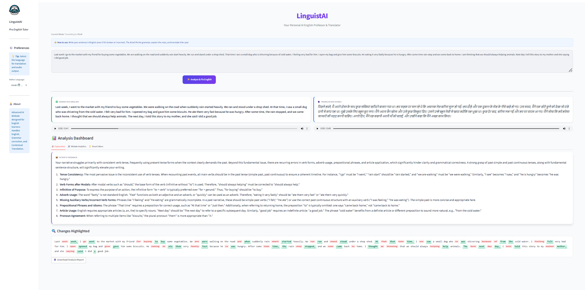

🎓 LinguistAI - Pro English Tutor

Final Year Computer Engineering Project

LinguistAI is an advanced Natural Language Processing (NLP) application designed to assist Indian students in mastering the English language. Unlike standard translators, this tool acts as a strict English professor: it corrects grammar, explains mistakes in clear English, and provides audio translations in the user's native mother tongue to ensure complete understanding.

✨ Key Features

Strict English Correction: Focuses purely on improving English syntax, tense, and semantics.

Native Language Audio Integration: Uses Text-to-Speech (TTS) to speak the translated meaning in Indian languages (Hindi, Tamil, Marathi, Telugu, etc.) alongside the English correction.

Smart Idiom Suggester: Automatically suggests professional idioms (e.g., "piece of cake") to replace simple phrases (e.g., "very easy").

Error Analytics Dashboard: Visualizes the user's weak points (Grammar vs. Spelling vs. Tense) using interactive charts.

Modular Architecture: Built with a clean separation of concerns (Frontend UI vs. Backend Logic) for scalability and maintainability.

📂 Project Structure

The project follows a professional modular architecture:

LinguistAI/
├── app.py                  # Main Application Entry Point
├── .env                    # API Security (Not tracked by git)
├── requirements.txt        # Project Dependencies
├── backend/
│   ├── ai_engine.py        # Logic: Google Gemini Interaction
│   └── audio_engine.py     # Logic: Text-to-Speech Generation
├── frontend/
│   ├── styles.py           # UI: Professional CSS Styling
│   └── components.py       # UI: Reusable Sidebar & Cards
└── utils/
    ├── helpers.py          # Logic: Diff Generation & Readability
    └── config.py           # Data: Language Mappings

🛠️ Technology Stack

Frontend: Streamlit (Python) with Custom CSS

AI Engine: Google Gemini 2.5 Flash

Audio Processing: gTTS (Google Text-to-Speech)

Data Analytics: Pandas & Streamlit Native Charts

Readability Metrics: Textstat (Flesch Reading Ease)

🚀 Installation & Setup

Prerequisites

Python 3.8 or higher installed.

VS Code (Visual Studio Code).

A Google Gemini API Key.

Step 1: Clone the Repository

git clone [https://github.com/your-username/LinguistAI.git](https://github.com/your-username/LinguistAI.git)
cd LinguistAI

Step 2: Install Dependencies

Open your terminal in the project folder and run:

pip install -r requirements.txt

Step 3: Configure Security

Create a new file named .env in the root LinguistAI/ folder.

Open the file and add your API key like this:

GEMINI_API_KEY=your_actual_api_key_here

(Note: The .env file is included in .gitignore to prevent leaking API keys).

Step 4: Run the Application

Run the following command in your terminal:

streamlit run app.py

The application will automatically open in your default web browser (usually at http://localhost:8501).

🔮 Future Scope

Voice-to-Voice Practice: Implement speech recognition to allow users to speak instead of type.

Mobile Application: Convert the web app into a mobile-friendly Flutter or React Native app.

Gamification: Add a "Streak" system and badges for consistent learning.

📄 License

This project is licensed under the MIT License - see the LICENSE file for details.

